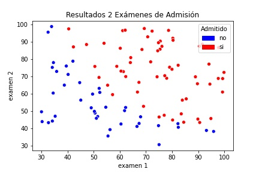
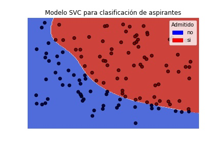

# Solución Reto Examén de Admisión
Solución al reto de Machine Learning de  [Colomb-ia: Retos de Machine Learning.](https://github.com/danielgil1/supervised-basico-admission-exams)

#### -- Estado: Terminado - Precisión 100%


## Objetivo:
- Crear un algortimo que tome como input un los resultados del examen 1 y 2 y retorne si el estudiante fue admitido o no. Solo se pueden utilizar los datos del train-set.csv para entrenar.



### Metodos Usados
* Visualización de datos.
* Clasificador de Maquina de Soporte Vectorial.


### Tenologías
* Python
* Pandas, jupyter.
* Scikit-learn

## Descripción del Proyecto
- Utilizando un algoritmo de clasificación SVM con kernel RBF se entrenó el modelo con los datos de las notas de los exámenes 1 y 2. Se realizó el testing con los datos brindados con una puntiación de 100%. Para ver la metodología de la solución del reto abrir el archivo Reto_ML_admisiones.ipynb.




## Empezar

1. Clonar el repositorio o descargar en .zip.
2. Para descargar y visualizar los datos necesitas Python 2 o 3. Las dependencias las puedes encontrar en el archivo requirements.txt. Puedes instalarlas fácilmente utilizando el commando

```bash
pip install -r requirements.txt
```
- Dependiendo de tu entorno puede que necesites instalar paquetes del sistema adicionales, si tienes problemas revisa la documentación de estas librerías.
    
3. En el directorio principal correr el siguiente comando para ejecutar el programa.

```bash
python main.py
```

4. Ingresar los valores solicitados los cuales son las notas del examen 1 y 2. El resultado será un aprobado o no aprobado con base al modelo creado.


## Contacto
* Github: [jtruji68](https://github.com/jtruji68).  
* linkedin: [juandavidortiztrujillo](https://www.linkedin.com/in/juandavidortiztrujillo/). 
* Email: jtruji68@gmail.com